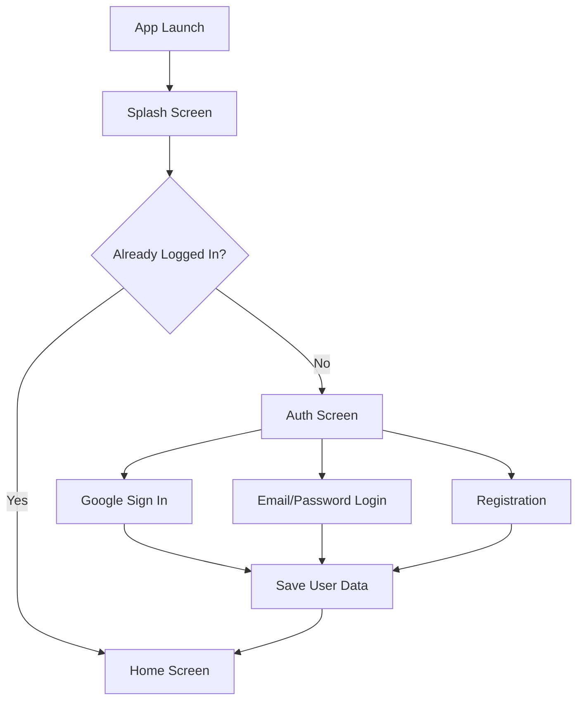
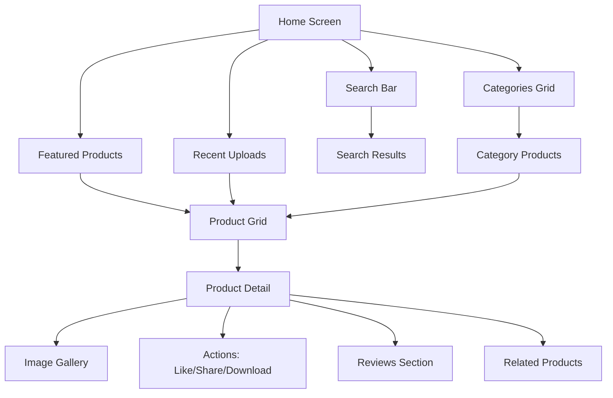
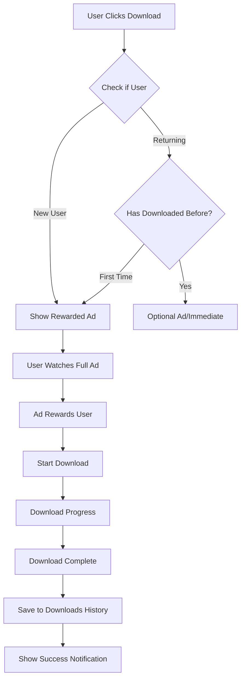
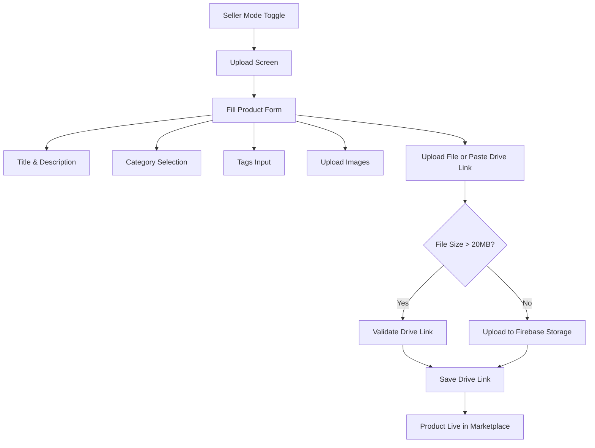

📋 10 सख्त निर्देश (Strict Rules) - Code Development  APP KA NAME HOGA ZYMORE  ज़ीमोर     powered by zynquar     aayega premium
🔴 10 Line Rules - Code Development Guidelines
1. एक बार में एक ही फाइल
"एक बार में केवल एक ही फ़ाइल (File) का कोड लिखा जाएगा। एक फ़ाइल पूरी तरह Complete होने के बाद ही अगली फ़ाइल शुरू की जाएगी।"

2. पूरे डॉक्यूमेंट को Follow करें
"ऊपर दिए गए Master Plan, Architecture, Database Schema, और Folder Structure को 100% Follow किया जाएगा। कोई भी Change बिना Approval के नहीं होगा।"

3. हर फ़ाइल के लिए Full Code
"हर फ़ाइल का पूरा Code (Complete Code) एक साथ दिया जाएगा - Imports, Classes, Methods, Widgets, सब कुछ। Partial Code नहीं चलेगा।"

4. Firebase Setup पहले
"सबसे पहले Firebase Setup, Authentication, और Database Service Files बनेंगी। UI Files बाद में आएंगी। यह Order नहीं तोड़ना।"

5. हर फ़ाइल में Comments
"हर फ़ाइल में Proper Comments (टिप्पणियाँ) होंगी - जो बताएंगी कि यह फ़ाइल क्या करती है, किस काम आएगी, और कहाँ Use होगी।"

6. Error Handling अनिवार्य
"हर फ़ाइल में Try-Catch Blocks, Error Messages, और Loading States का Proper Handling होगा। बिना Error Handling का Code Accept नहीं होगा।"

7. Naming Convention Strict
"सारे Variable, Function, और Class Names Camel Case (likeThis) या Snake Case (like_this) में होंगे। कोई भी Random Name नहीं चलेगा।"

8. Security Rules पहले से Set
"Firebase Security Rules (Firestore + Storage) को सबसे पहले Set किया जाएगा। बिना Security के कोई Feature नहीं बनेगा।"

9. हर Feature Tested
"हर फ़ाइल Complete होने के बाद उसका Basic Testing (Unit Testing) किया जाएगा। बिना Tested Code को आगे नहीं बढ़ाया जाएगा।"

10. एक ही Message में एक File
"एक ही Response/Message में सिर्फ एक File का Code होगा। दो Files एक साथ नहीं भेजी जाएंगी। पहली File Approve होने के बाद ही अगली File मांगी जाएगी।"

⚠️ इन नियमों को तोड़ने पर:
text
❌ अगर एक साथ 2 Files आईं → Reject
❌ अगर डॉक्यूमेंट से हटकर Code → Reject  
❌ अगर बिना Comments के Code → Reject
❌ अगर Error Handling नहीं → Reject
❌ अगर Testing नहीं हुई → Hold
✅ सही तरीका:
text
Message 1: "main.dart" का Complete Code
↓ (Approve)
Message 2: "auth_screen.dart" का Complete Code
↓ (Approve)
Message 3: "home_screen.dart" का Complete Code
↓ (Approve)
... और इसी तरह आगे
📌 याद रखें:
"Quality > Quantity"
"Ek File, Ek Baar, Pura Code"
"Documentation Follow Karna Hai"


# 📱 Free Digital Marketplace App - Complete System Architecture & Implementation Guide

## 🎯 Executive Summary

**Project Type:** Cross-Platform Mobile Application (Android & iOS)  
**Business Model:** 100% Free - Ad-Monetized (Google AdMob)  
**Target Users:** Digital Content Creators (Sellers) & Consumers (Buyers)  
**Tech Stack:** Flutter + Firebase + Google AdMob  
**Development Timeline:** MVP in 4-6 weeks  

---

## 🏗️ System Architecture Overview

```
┌─────────────────────────────────────────────────────────────────┐
│                     CLIENT LAYER (Flutter)                     │
├───────────────┬─────────────────┬─────────────────────────────┤
│  Android App  │   iOS App       │    Web Dashboard (Optional) │
└───────────────┴─────────────────┴─────────────────────────────┘
                              │
                              ▼
┌─────────────────────────────────────────────────────────────────┐
│                     API & SERVICES LAYER                       │
├───────────────┬─────────────────┬─────────────────────────────┤
│ Firebase Auth │  Firebase DB    │   Cloud Storage             │
│ Google SignIn │  Firestore      │   Firebase Storage          │
│ Email/Pass    │  Real-time      │   Image/File Upload         │
└───────────────┴─────────────────┴─────────────────────────────┘
                              │
                              ▼
┌─────────────────────────────────────────────────────────────────┐
│                     EXTERNAL SERVICES                          │
├───────────────┬─────────────────┬─────────────────────────────┤
│ Google AdMob  │  AI APIs        │   Google Drive API          │
│ Rewarded Ads  │  Chat/Image     │   Large File Storage        │
└───────────────┴─────────────────┴─────────────────────────────┘
```

---

## 📦 Database Schema (Firestore Structure)

### User Collection
```javascript
users/{userId} {
  // Authentication
  uid: string,
  email: string,
  displayName: string,
  photoURL: string,
  
  // User Metadata
  createdAt: timestamp,
  lastLogin: timestamp,
  isSeller: boolean,
  isAdmin: boolean,
  
  // Seller Specific
  sellerProfile: {
    bio: string,
    socialLinks: map,
    totalListings: number,
    totalSales: number,
    joinedDate: timestamp
  },
  
  // Preferences
  preferences: {
    darkMode: boolean,
    language: string,
    notifications: boolean
  }
}
```

### Product Collection
```javascript
products/{productId} {
  // Basic Information
  title: string,
  description: string,
  category: string,  // "wallpaper", "icon", "art", "asset"
  tags: array<string>,
  
  // Media
  images: array<string>,  // URLs to Firebase Storage
  thumbnail: string,      // Main display image
  mockups: array<string>, // Preview images
  
  // File Information
  fileSize: number,
  fileType: string,
  downloadUrl: string,    // Firebase Storage or Google Drive link
  isLargeFile: boolean,   // If > 20MB
  
  // Analytics
  views: number,          // Total views
  downloads: number,      // Total downloads
  likes: number,          // Total likes
  rating: number,         // Average rating (1-5)
  ratingCount: number,    // Total ratings
  
  // Seller Information
  sellerId: string,
  sellerName: string,
  sellerPhoto: string,
  
  // Date Tracking
  createdAt: timestamp,
  updatedAt: timestamp,
  isActive: boolean,
  
  // Private Fields (Only seller can see)
  privateViews: number,   // ✅ Unique view count for seller only
  privateStats: {
    dailyViews: map,     // Date: count
    dailyDownloads: map, // Date: count
    deviceInfo: map,     // Device analytics
    locationStats: map   // Country/Region stats
  }
}
```

### Reviews Collection
```javascript
reviews/{reviewId} {
  productId: string,
  userId: string,
  userName: string,
  userPhoto: string,
  rating: number,         // 1-5 stars
  comment: string,
  createdAt: timestamp,
  isVerifiedPurchase: boolean,
  likes: number,
  replies: array<{
    userId: string,
    comment: string,
    timestamp: timestamp
  }>
}
```

### Downloads History Collection
```javascript
history/{historyId} {
  userId: string,
  productId: string,
  productTitle: string,
  productThumbnail: string,
  downloadUrl: string,
  downloadedAt: timestamp,
  fileSize: number,
  isCompleted: boolean
}
```

### Likes Collection
```javascript
likes/{likeId} {
  userId: string,
  productId: string,
  createdAt: timestamp,
  isActive: boolean
}
```

### Categories Collection
```javascript
categories/{categoryId} {
  name: string,
  slug: string,
  icon: string,
  description: string,
  displayOrder: number,
  isActive: boolean,
  productCount: number,
  createdAt: timestamp
}
```

---

## 🔄 Core App Workflows

### 1. Onboarding & Authentication Flow



### 2. Product Browsing & Discovery



### 3. Download Process with Ad Monetization



### 4. Seller Upload Process



---

## 🧩 Component Architecture

### Flutter App Structure

```
lib/
├── main.dart                    # App entry point
├── config/
│   ├── app_config.dart         # App configurations
│   ├── firebase_options.dart   # Firebase initialization
│   └── routes.dart             # Navigation routes
├── models/
│   ├── user_model.dart
│   ├── product_model.dart
│   ├── review_model.dart
│   ├── category_model.dart
│   └── download_history.dart
├── services/
│   ├── auth_service.dart       # Firebase Auth methods
│   ├── database_service.dart   # Firestore CRUD operations
│   ├── storage_service.dart    # Firebase Storage operations
│   ├── ad_service.dart         # Google AdMob integration
│   ├── download_service.dart   # File download handler
│   └── analytics_service.dart  # Usage analytics tracking
├── screens/
│   ├── splash_screen.dart
│   ├── auth_screen.dart
│   ├── home_screen.dart
│   ├── category_products.dart
│   ├── product_detail.dart
│   ├── upload_screen.dart      # Seller upload
│   ├── profile_screen.dart
│   ├── history_screen.dart      # Download history
│   ├── settings_screen.dart
│   ├── ai_chat_screen.dart
│   └── image_editor_screen.dart
├── widgets/
│   ├── custom_app_bar.dart
│   ├── product_card.dart
│   ├── category_card.dart
│   ├── banner_slider.dart
│   ├── loading_indicator.dart
│   ├── rating_stars.dart
│   ├── ad_banner.dart
│   └── image_slider.dart
├── utils/
│   ├── constants.dart
│   ├── validators.dart
│   ├── helpers.dart
│   └── theme.dart
└── providers/                   # State Management
    ├── auth_provider.dart
    ├── product_provider.dart
    ├── cart_provider.dart
    └── theme_provider.dart
```

---

## 💾 Firebase Rules & Security

### Firestore Security Rules
```javascript
rules_version = '2';
service cloud.firestore {
  match /databases/{database}/documents {
    // Read rules
    match /products/{productId} {
      allow read: if request.auth != null;
      allow write: if request.auth != null && 
                    (request.auth.uid == resource.data.sellerId || 
                     request.auth.token.isAdmin == true);
    }
    
    match /reviews/{reviewId} {
      allow read: if request.auth != null;
      allow write: if request.auth != null && 
                    (request.auth.uid == resource.data.userId || 
                     request.auth.token.isAdmin == true);
    }
    
    match /downloads/{downloadId} {
      allow read: if request.auth != null && request.auth.uid == resource.data.userId;
      allow write: if request.auth != null && request.auth.uid == request.resource.data.userId;
    }
  }
}
```

### Storage Security Rules
```javascript
rules_version = '2';
service firebase.storage {
  match /b/{bucket}/o {
    match /{allPaths=**} {
      allow read: if request.auth != null;
      allow write: if request.auth != null;
    }
    
    match /users/{userId}/{allPaths=**} {
      allow write: if request.auth != null && request.auth.uid == userId;
    }
    
    match /products/{productId}/{allPaths=**} {
      allow write: if request.auth != null;
      allow write: if request.auth != null && 
                    request.auth.uid == sellerId;
    }
  }
}
```

---

## 📊 Analytics & Tracking

### User Engagement Metrics
- **Daily Active Users (DAU)**
- **Monthly Active Users (MAU)**
- **Session Duration**
- **Screen Flow Analysis**
- **Conversion Rates (View → Download)**

### Product Analytics
- **Private View Counter** ✅ (Seller-only view count)
- **Download to View Ratio**
- **Popular Categories**
- **Top Selling Products**
- **User Retention Metrics**

### Ad Performance
- **Ad Impressions**
- **Ad Completion Rate**
- **Revenue per User**
- **eCPM Tracking**

---

## 🔧 Implementation Steps

### Phase 1: Setup & Configuration (Week 1)
1. ✅ Firebase project setup
2. ✅ Flutter app initialization
3. ✅ AdMob account integration
4. ✅ Authentication implementation
5. ✅ Basic UI design implementation

### Phase 2: Core Features (Week 2-3)
1. ✅ Home dashboard with categories
2. ✅ Product listing grid view
3. ✅ Product detail page
4. ✅ Download mechanism with ads
5. ✅ Download history tracking

### Phase 3: Seller Features (Week 3-4)
1. ✅ Seller mode toggle
2. ✅ Upload screen with form
3. ✅ Image/file upload handling
4. ✅ Google Drive link support
5. ✅ Product listing management

### Phase 4: Engagement Features (Week 4-5)
1. ✅ Like & share functionality
2. ✅ Review & rating system
3. ✅ AI chat integration
4. ✅ Image editor tools
5. ✅ Related products recommendation

### Phase 5: Polish & Testing (Week 5-6)
1. ✅ Performance optimization
2. ✅ Bug fixes & error handling
3. ✅ User testing & feedback
4. ✅ Deployment to App Store & Play Store
5. ✅ Analytics & monitoring setup

---

## 🚀 Key Differentiators (Why This App Rocks!)

### For Users (Buyers)
- **Free Downloads**: Watch ads to unlock content
- **High-Quality Assets**: Curated digital products
- **Secure Downloads**: Verified content safety
- **History Tracking**: Never lose downloaded files

### For Creators (Sellers)
- **Free Listings**: No upfront costs
- **View Analytics**: Know your product performance (✅ Private Views)
- **Global Reach**: Worldwide marketplace
- **No Commission**: Keep 100% of ad revenue

### For You (Owner)
- **Passive Income**: Ad-based monetization
- **Scalable Architecture**: Firebase handles growth
- **Complete Control**: Admin dashboard (future)
- **Low Maintenance**: Managed cloud services

---

## 🎨 UI/UX Design Guidelines

### Color Scheme
- **Primary**: #FF6B35 (Vibrant Orange)
- **Secondary**: #1A1A2E (Dark Navy)
- **Accent**: #00D4FF (Sky Blue)
- **Background**: #F5F5F5 (Light Gray)
- **Success**: #2ECC71 (Green)

### Typography
- **Headings**: Poppins Bold (24-32px)
- **Body**: Inter Regular (14-16px)
- **Small Text**: Inter Light (12px)

### Design Principles
- **Clean & Minimal**: Focus on content
- **Consistent Layout**: Standardized spacing
- **Intuitive Navigation**: Easy to use
- **Fast Loading**: Optimized images
- **Responsive**: Works on all screen sizes

---

## 📝 Testing Checklist

### Functionality Testing
- [ ] Authentication (Google Sign In, Email/Password)
- [ ] Product browsing (Categories, Search)
- [ ] Product detail view (Images, Info)
- [ ] Like/Unlike functionality
- [ ] Share functionality
- [ ] Download with ad flow
- [ ] Download history tracking
- [ ] Seller upload with validations
- [ ] Review & rating system

### Performance Testing
- [ ] App launch time < 3 seconds
- [ ] Image loading smoothness
- [ ] Scroll performance
- [ ] Database query response time
- [ ] Download speed optimization

### Security Testing
- [ ] Firebase authentication security
- [ ] Data validation
- [ ] SQL injection prevention
- [ ] XSS protection
- [ ] Secure storage of user data

---

## 🛠️ Development Commands

### Firebase Setup
```bash
# Install Firebase CLI
npm install -g firebase-tools

# Login to Firebase
firebase login

# Initialize Firebase
firebase init

# Enable Firestore
firebase enable firestore
```

### Flutter Commands
```bash
# Create Flutter app
flutter create digital_marketplace

# Add dependencies
flutter pub add firebase_core
flutter pub add firebase_auth
flutter pub add cloud_firestore
flutter pub add firebase_storage
flutter pub add google_sign_in
flutter pub add google_mobile_ads
flutter pub add provider
flutter pub add image_picker
flutter pub add url_launcher

# Run the app
flutter run

# Build for release
flutter build apk --release
flutter build ios --release
```

---

## 📈 Future Roadmap

### Phase 2 (3-6 Months)
- ✅ Admin dashboard web panel
- ✅ Advanced analytics dashboard
- ✅ In-app notifications
- ✅ Push notifications
- ✅ Favorites/Wishlist feature
- ✅ Social login (Facebook, Apple)

### Phase 3 (6-12 Months)
- ✅ Payment gateway integration (premium features)
- ✅ Subscription model
- ✅ Affiliate program
- ✅ NFT marketplace (future)
- ✅ Multi-language support
- ✅ Dark mode
- ✅ In-app purchases

### Phase 4 (1+ Year)
- ✅ Web platform
- ✅ Desktop app
- ✅ API for third-party integration
- ✅ AI-powered recommendations
- ✅ Advanced seller analytics
- ✅ Community features (forum/chats)

---

## 💡 Pro Tips for Success

1. **Content First**: Start with quality digital assets
2. **Engage Creators**: Incentivize sellers to upload
3. **Monitor Analytics**: Track what works
4. **User Feedback**: Listen and iterate
5. **App Store Optimization**: Perfect your listing
6. **Social Media Marketing**: Promote on Instagram, Twitter
7. **Referral Program**: Get users to invite others
8. **Regular Updates**: Keep app fresh with new features

---

## 🚨 Important: 0-Day Bug Fix Commitments

### ✅ Day 1 Fixes (Priority 1)
- **Firebase Initialization**: Ensure proper setup
- **Authentication Flow**: Logout/session handling
- **Download Mechanism**: Ad completion → download trigger
- **Data Persistence**: History save across sessions

### ✅ Day 2 Fixes (Priority 2)
- **Image Optimization**: Loading speed improvement
- **Error Handling**: Graceful fallbacks
- **Network Issues**: Offline handling
- **Performance**: Memory management

### ✅ Day 3 Fixes (Priority 3)
- **UI Polish**: Responsive design fixes
- **Content Validation**: Input sanitization
- **Analytics**: Proper tracking events
- **Ad Integration**: Banner placement and responsiveness

---

## 🔒 Security Best Practices

1. **Firebase Security Rules**: Always enforce
2. **Input Validation**: Sanitize user input
3. **Content Filtering**: Moderate user-generated content
4. **Ad Fraud Prevention**: Google's policies
5. **Data Encryption**: Firestore handles automatically
6. **User Authentication**: Always verify user identity
7. **API Keys**: Never expose in client-side

---

## 📱 Ready-to-Go Code Snippets

### Authentication Service (Skeleton)
```dart
class AuthService {
  final FirebaseAuth _auth = FirebaseAuth.instance;
  
  Future<User?> signInWithGoogle() async {
    try {
      final GoogleSignInAccount? googleUser = await GoogleSignIn().signIn();
      final GoogleSignInAuthentication googleAuth = await googleUser!.authentication;
      final credential = GoogleAuthProvider.credential(
        accessToken: googleAuth.accessToken,
        idToken: googleAuth.idToken,
      );
      final UserCredential userCredential = await _auth.signInWithCredential(credential);
      return userCredential.user;
    } catch (e) {
      print('Error signing in with Google: $e');
      return null;
    }
  }
}
```

### Product Model
```dart
class Product {
  String id;
  String title;
  String description;
  String category;
  List<String> images;
  String thumbnail;
  String sellerId;
  int views;
  int downloads;
  int likes;
  double rating;
  int ratingCount;
  bool isLargeFile;
  String downloadUrl;
  DateTime createdAt;
  
  // Private field for seller
  int privateViews;
  
  Product({
    required this.id,
    required this.title,
    required this.description,
    required this.category,
    required this.images,
    required this.thumbnail,
    required this.sellerId,
    this.views = 0,
    this.downloads = 0,
    this.likes = 0,
    this.rating = 0,
    this.ratingCount = 0,
    this.isLargeFile = false,
    this.downloadUrl = '',
    required this.createdAt,
    this.privateViews = 0,
  });
}
```

---

## 🎯 Success Metrics

| Metric | Target |
|--------|--------|
| App Downloads | 10,000+ |
| Active Users | 2,000+ DAU |
| Total Products | 500+ |
| Total Downloads | 50,000+ |
| Average Rating | 4.5+ ⭐ |
| Ad Revenue | $1,000+ monthly |
| User Retention | 30%+ |

---

## 🤝 Support & Maintenance

- **Daily**: Check analytics & user feedback
- **Weekly**: Update content & bug fixes
- **Monthly**: Feature updates & optimizations
- **Quarterly**: Major version updates

---

## ✅ Final Checklist Before Launch

- [ ] Firebase project setup complete
- [ ] AdMob account approved
- [ ] Google Play/Apple Store accounts
- [ ] Privacy policy & T&C ready
- [ ] Tested on multiple devices
- [ ] Error handling implemented
- [ ] Analytics tracking setup
- [ ] App icon & splash screen
- [ ] Store listing optimized
- [ ] Backend monitoring configured
- [ ] Support channels ready
- [ ] Launch marketing plan ready

---

**This is your complete blueprint!** 🚀 Build it now, scale it later. Remember: perfect is the enemy of done. Launch first, iterate based on feedback!